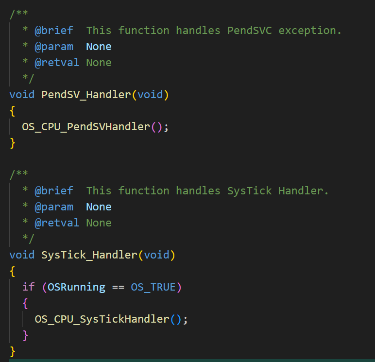

# 一、参考链接

1. 准备点灯工程：https://zhangsz.blog.csdn.net/article/details/132050595

2. ucosii 源码移植：https://zhangsz.blog.csdn.net/article/details/132071966

3. ucosii 点灯：https://zhangsz.blog.csdn.net/article/details/132071966


# 二、下载 ucosii 源码

git clone https://github.com/weston-embedded/uC-OS2


# 三、复制 ucosii 源码

1. 首先，在点灯工程中新建一个 ucosii 文件夹，用来存放 ucosii 的源代码。

2. 接着在 ucosii 源代码中依次新建 Core、Ports、Cfg 这三个文件夹，功能如下：

    | 文件夹 |              功能              |
    | :----: | :----------------------------: |
    |  Core  |   存放不用修改的 ucosii 源码   |
    | Ports  | 存放需要根据硬件平台修改的源码 |
    |  Cfg   |      存放 ucosii 配置文件      |


3. 进入 ucosii 源码文件夹，进入 Source 文件夹，将里面的文件复制到上一步创建的 Core 文件夹中

    


4. 进入 ucosii 源码文件夹，进入 Ports\ARM-Cortex-M\ARMv7-M 文件夹，将里面的 ARM、IAR、os_cpu_c.c 文件复制到上一步创建的 Ports 文件夹中

    

    补充说明一下，ARM 文件夹适配的是 MDK-Keil IDE，IAR 文件夹适配的是 IAR IDE，我两个 IDE 都有使用，因此都复制了，这里可以根据自己使用的 IDE ，只复制 ARM 或者 IAR 文件夹就可以了


5. 进入 ucosii 源码文件夹，进入 Cfg\Template 文件夹，将里面的文件复制到上一步创建的 Cfg 文件夹中

    

6. 下面是复制好的文件树

    


# 四、添加 ucosii 源码

这里以 MDK-Keil 为例，展示如何向工程中添加 ucosii 源码。

1. 如下图所示，依次添加 ucosii/Core、ucosii/Ports、ucosii/Cfg 这三个 Group

    

2. 往 ucosii/Core 中添加 ucosii 内核源代码，把所有的 .c 文件都添加到上一步创建的 ucosii/Core Group 中

    

3. 添加 Ports 文件夹中的文件，这些是跟硬件平台、编译器相关的代码，这里用的是 Keil 开发环境，用的是 armcc、armclang 编译器，所以要添加 ucosii\Ports\ARM 文件夹中的文件。此外，还要添加 os_cpu_c.c 文件

    

    

4. 添加配置文件，这些文件是用来裁剪 ucosii 内核，以及配置 ucosii 运行参数的

    

5. 下面是添加好的工程结构

    

6. 添加 ucosii 头文件路径，把所有带头文件的文件夹路径添加到工程搜索路径中

    


# 五、解决编译报错

1. 编译一下，会产生如下报错，这是因为没有在 app_cfg.h 中定义 CPU_CFG_KA_IPL_BOUNDARY 和 CPU_CFG_NVIC_PRIO_BITS 这两个宏

    

2. 在 app_cfg.h 中添加

    ```C
    #ifndef CPU_CFG_KA_IPL_BOUNDARY
    #define CPU_CFG_KA_IPL_BOUNDARY             4u
    #endif

    #ifndef CPU_CFG_NVIC_PRIO_BITS
    #define CPU_CFG_NVIC_PRIO_BITS              4u /* 中断优先级位数 */
    #endif
    ```

3. 接着编译会产生链接错误，这是因为 ucosii/Core/os_dbg_r.c 和 ucosii/Ports/os_dbg.c 这两个文件冲突了

    

4. 把 ucosii/Core/os_dbg_r.c 和 ucosii/Core/ucos_ii.c 从工程中移除掉就好了
    
    


# 六、修改 SysTick 和 PendSV

1. ucosii 的运行需要时钟节拍作为任务调度的参考，需要 PendSV 中断实现上下文切换，这两个函数 ucosii 都实现了，只需要在相应的中断函数中调用即可

    

2. 修改 ucosii 任务切换的周期，在 os_cfg.h 中搜索 OS_TICKS_PER_SEC ，将值修改成 1000u

    


# 七、点个灯~

上一步已经将 ucosii 移植完毕了，下面用 ucosii 创建两个任务，一个任务间隔一秒点亮火熄灭一次 LED 小灯，另一个任务间隔一秒用串口打印一次 "hello world"

```C
/* Includes ------------------------------------------------------------------*/
#include "stm32f10x.h"
#include <stdio.h>

// #include "bsp_systick.h"
#include "bsp_led.h"
#include "bsp_uart.h"

#include "ucos_ii.h"

#define TASK_LED_PRIO 5
#define TASK_LED_STACK_SIZE 128
static OS_STK task_led_stack[TASK_LED_STACK_SIZE];

static void task_led_entry(void *p_arg)
{
    while (1)
    {
        led_control(BSP_LED_ON);
        OSTimeDly(1000);
        led_control(BSP_LED_OFF);
        OSTimeDly(1000);
    }
}

#define TASK_UART1_PRIO 6
#define TASK_UART1_STACK_SIZE 128
static OS_STK task_uart1_stack[TASK_UART1_STACK_SIZE];

static void task_uart1_entry(void *p_arg)
{
    while (1)
    {
        printf("hello world\r\n");
        OSTimeDly(1000);
    }
}

int main(void)
{
    OS_CPU_SysTickInitFreq(SystemCoreClock);
    led_init();
    uart1_init(115200);

    OSInit();
    OSTaskCreate(task_led_entry, (void *)0, &task_led_stack[TASK_LED_STACK_SIZE - 1], TASK_LED_PRIO);
    OSTaskCreate(task_uart1_entry, (void *)0, &task_uart1_stack[TASK_UART1_STACK_SIZE - 1], TASK_UART1_PRIO);
    OSStart();
}

```
